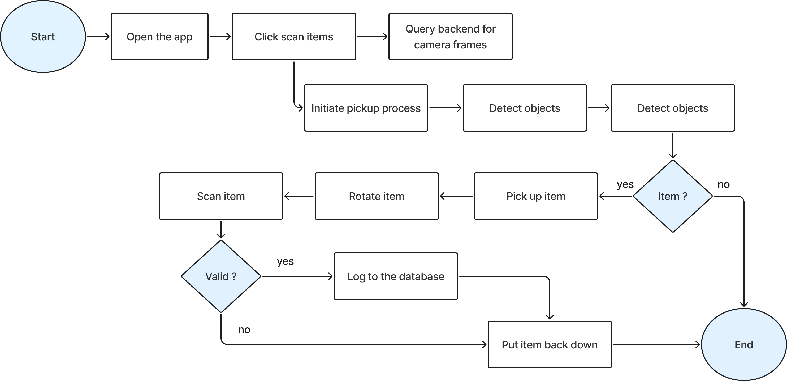

# AMD_Robotics_Hackathon_2025_Forager

**Title:** AMD_RoboticHackathon2025-Forager

**Team:** Mushroom Stew
- Jonathan Setiawan
- Brandon Pratama Kwee
- Great Gilbert Soco
- Yamane Leon

## Summary
**Vision-Guided Mobile Manipulation for Home Grocery Organization and Item Sorting**

This is a project developed for the AMD Robotics Hackathon 2025 held in Tokyo from Dec 5, 2025 ~ Dec 7, 2025. We are a team of second years from Ritsumeikan University, Osaka, Japan and we aim to build an **autonomous home-assistant robot** for grocery organization and item sorting. The system is designed to be **end-to-end embodied perception and manipulation**, integrating Vision-Language Perception, Object Grasping, Placement Task Planning, and Item Logging. It is capable of:
* Detecting multiple grocery items in a **cluttered table or bag**
* **Picking items** using a robotic arm and **scanning them visually**
* **Classifying** items into semantic categories (e.g., produce vs. packaged goods)
* **Organizing/storage actions** such as placing items into baskets or bins
* Maintaining a **simple digital inventory** of recognized items

## What we wanted to do
* We wanted to to build a system that can identify any kind of object held in a bag or on a table, scan the item, classify them, and then store it in a database. The data will then be able to be displayed on a mobile app for users to see their inventory and log history. 
* We also wanted to incorporate QR codes for situations where this is deployed in a convenience store or a 100 yen shop in Japan. The QR code will be able to store the item information and the price of the item along with updates on the inventory. The robot would pick up the item, try to scan the QR code initially and if it doesn't see it, it will try to rotate the item across all the surface areas, and if it's not able to see the barcode at all, it will just place it back where it picked it up.

## Achievements
* 
* 

## Challenges
* The teleoperation and imitation learning using LeRobot's ecosystem costed us a lot of time as we were in unfamiliar territory and kept running into a lot of errors which took a lot of time to debug and even the training or improvement aspect of the model had a lot of issues that we were not familiar with.
* We were also limited to just one working computer since we also only have access to 2 working SO-101 robotic arms, as we did not aspect that we would need extra equipment, we ended up having to take turns on the laptop, be it for the motion control aspect of the project or the software development aspect of the project.

## Flowchart

The workflow begins when the user opens the "Forager" app and clicks "scan items," which triggers the backend to request camera frames and initiate the robotic pickup process. The system then detects objects in the workspace; if an item is found, the robot picks it up and physically rotates it to ensure the camera can find a valid QR code or identifiable feature. Once scanned and validated, the system logs the item into the database before the robot places it back down, completing the cycle from physical manipulation to digital inventory tracking.

## Future Applications
This technology and concept extends beyond home organization. It has significant potential for retail environments, such as:
*   **Convenience Stores & 100 Yen Shops (Japan)**: Automating the checkout process where a robotic arm transfers items from a shopping basket, scans them, and places them into a bagging area or another basket.
*   **Cost-Effective Deployment**: By utilizing a vision-guided system with simpler robotic arms, this solution offers a cheaper alternative to industrial-grade automation, making it accessible for common commercial spaces and faster to deploy.

## How To Setup

### Prerequisites
* Python 3.8+
* Node.js & npm
* Expo CLI (`npm install -g expo-cli`)
* Expo Go Mobile Application for testing(IOS / Android)
* Conda

### Environment Setup (AMD Ryzen AI)

This project uses the `lerobot` environment. Below are the steps to set it up on an AMD Ryzen AI PC (e.g., Ryzen AI 9 HX370).

#### Target Environment
*   **OS**: Ubuntu 24.04
*   **ROCm**: v6.3+
*   **PyTorch**: v2.7.x
*   **LeRobot**: v0.4.1

#### Prerequisites
1.  **BIOS Settings**: Set VRAM to 16GB+.
    *   Example: `Advanced => GFX Configuration => UMA Frame buffer Size => 16GB`
2.  **Install ROCm 6.3.x**:
    ```bash
    sudo apt update
    sudo apt install "linux-headers-$(uname -r)" "linux-modules-extra-$(uname -r)" python3-setuptools python3-wheel
    sudo usermod -a -G render,video $LOGNAME
    wget https://repo.radeon.com/amdgpu-install/6.3.4/ubuntu/noble/amdgpu-install_6.3.60304-1_all.deb
    sudo apt install ./amdgpu-install_6.3.60304-1_all.deb
    amdgpu-install -y --usecase=rocm --no-dkms
    sudo reboot
    ```
3.  **Set iGPU Mode**:
    ```bash
    echo "export HSA_OVERRIDE_GFX_VERSION=11.0.0" >> ~/.bashrc
    source ~/.bashrc
    ```

#### LeRobot Environment Setup
1.  **Create Conda Environment**:
    ```bash
    conda create -n lerobot python=3.10
    conda activate lerobot
    ```
2.  **Install PyTorch (ROCm)**:
    ```bash
    pip install torch==2.7.1 torchvision==0.22.1 torchaudio==2.7.1 --index-url https://download.pytorch.org/whl/rocm6.3
    ```
3.  **Install LeRobot**:
    ```bash
    conda install ffmpeg=7.1.1 -c conda-forge
    git clone https://github.com/huggingface/lerobot.git
    cd lerobot
    git checkout -b v0.4.1 v0.4.1
    pip install -e .
    pip install 'lerobot[feetech]'
    ```

### Backend
1. Navigate to the backend directory:
   ```bash
   cd mission2/code/backend
   ```
2. Activate the environment:
   ```bash
   conda activate lerobot
   ```
3. Install dependencies:
   ```bash
   pip install -r requirements.txt
   ```
   *(Note: You may need to install `uvicorn` and `fastapi` if they are not in requirements.txt, or ensure `api` module dependencies are met)*
4. Start the backend server:
   ```bash
   python main.py
   ```
   The server will start on `http://0.0.0.0:8000`.

### Frontend
1. Navigate to the frontend directory:
   ```bash
   cd mission2/code/frontend
   ```
2. Activate the environment:
   ```bash
   conda activate lerobot
   ```
3. Install dependencies:
   ```bash
   npm install
   ```
4. Start the Expo app:
   ```bash
   npx expo start
   ```
   Use the Expo Go app on your phone or an emulator to scan the QR code.

## Delivery URL

```text
•	URL of your dataset in Hugging Face
•	URL of your model in Hugging Face
```

## Directory Tree

```terminal
AMD_RoboticHackathon2025--Your-Work-of-Mission2-/
├── README.md
├── project_spec.md
├── inventory.db
├── mission1/
│   └── ...
└── mission2/
    ├── code/
    │   ├── backend/
    │   │   ├── api.py
    │   │   ├── main.py
    │   │   ├── requirements.txt
    │   │   ├── perception/
    │   │   ├── manipulation/
    │   │   ├── logic/
    │   │   └── data/
    │   └── frontend/
    │       ├── App.js
    │       ├── package.json
    │       └── ...
    └── wandb/
        └── <latest run directory>
```